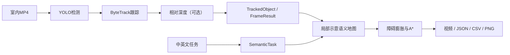

# SemanticNav AI

基于YOLO、ByteTrack、单目相对深度、局部示意语义地图与A*的室内机器人视觉导航软件原型。

用户上传室内MP4并输入“去椅子附近，避开人和宠物”等任务后，系统完成目标检测与跟踪、相对深度判断、非米制地图构建、示意路径规划以及结构化结果导出。

> 本项目输出相对深度、局部示意地图和动作建议，尚未接入真实机器人底盘；结果不构成安全控制指令。

## Demo

项目已通过浏览器上传、运行和结果下载冒烟测试。最终30～60秒作品集录屏请按[Demo脚本](docs/demo-script.md)完成；等待模型和深度推理的片段可以加速，但画面必须标注“加速播放”，不得将CPU结果描述为实时导航。

录屏完成后，可将压缩GIF放到`assets/demo.gif`并在此处展示。原始演示视频仍应保留在Git仓库外。

## 当前状态

作品集Demo的Task 1～12已经完成：

- Streamlit视频上传与参数控制；
- YOLO目标检测和ByteTrack轨迹ID；
- 可选Depth Anything V2相对深度；
- 30×30局部示意语义地图；
- 障碍膨胀和A*示意路径；
- 中英文规则任务解析；
- 标注视频、JSON、CSV和PNG下载；
- 一键性能基准与三场景失败分析；
- 94项自动化测试。

## 数据流



详细设计见[架构文档](docs/architecture.md)。

## 实测性能

硬件：Intel Core Ultra 5 125H、31.5 GB内存、无CUDA。

| 场景 | 输入尺寸 | 置信度 | 深度 | 帧数 | 平均FPS | YOLO平均推理/ms | P95总延迟/ms |
|---|---:|---:|---|---:|---:|---:|---:|
| E1 | 480 | 0.25 | 关闭 | 100 | 4.076 | 180.810 | 411.523 |
| E2 | 640 | 0.25 | 关闭 | 100 | 2.519 | 319.755 | 645.510 |
| E3 | 480 | 0.50 | 关闭 | 100 | 3.489 | 218.376 | 471.430 |
| E4 | 480 | 0.25 | 每5帧一次 | 20 | 0.532 | 256.040 | 7995.077 |

因此默认使用480、置信度0.25和关闭深度；展示完整闭环时使用短片段并每5帧运行一次深度。完整结果见[性能基准](benchmarks/README.md)。

## 三场景验证

| 场景 | 关键结果 | 平均FPS |
|---|---|---:|
| 用户室内视频 | `chair` 30/30帧、单一ID；`couch` 28/30帧、单一ID | 2.623 |
| 室内行人 | `person` 30/30帧、单一ID；瓶子出现一次轨迹碎片 | 0.786 |
| 室内猫 | `cat` 30/30帧、单一ID；柜体被误识别为冰箱3帧 | 1.368 |

素材来源见[评测视频记录](assets/samples/EVALUATION.md)，机器可读结果见[`scene_results.csv`](benchmarks/scene_results.csv)，失败原因见[失败案例](docs/failure-cases.md)。

## 环境要求

- Windows 11；
- Python 3.11；
- 建议32 GB内存；
- 不要求NVIDIA GPU；
- 第一次使用YOLO或深度模型时需要联网下载权重。

## 安装

```powershell
Set-Location "D:\semanticnav-ai-ros2"

conda create --prefix .\.venv python=3.11 pip -y
conda activate .\.venv

python -m pip install --upgrade pip
pip install -r requirements.txt
pip install -e .
```

## 启动Streamlit

```powershell
Set-Location "D:\semanticnav-ai-ros2"
conda activate .\.venv
streamlit run app\streamlit_app.py
```

推荐首次参数：

```text
任务：去椅子附近，避开人和宠物
检测置信度：0.25
YOLO输入尺寸：480
启用相对深度：关闭
最大处理帧数：30
```

模型首次初始化可能需要20～30秒。页面处理4K输入时，结果视频仍按原始尺寸编码，因此速度会低于普通手机视频。

## CLI运行

```powershell
python scripts\run_video.py `
  --input assets\samples\room.mp4 `
  --start-frame 270 `
  --max-frames 30 `
  --image-size 480 `
  --confidence 0.25 `
  --task "去椅子附近，避开人和宠物" `
  --output-root outputs
```

开启相对深度：

```powershell
$env:HF_HUB_DISABLE_XET="1"
python scripts\run_video.py `
  --input assets\samples\room.mp4 `
  --start-frame 270 `
  --max-frames 10 `
  --image-size 480 `
  --confidence 0.25 `
  --depth
```

## 输出文件

每次运行在`outputs/<run-id>/`生成：

| 文件 | 内容 |
|---|---|
| `annotated.mp4` | 检测框、类别、ID和轨迹视频 |
| `results.json` | 每帧目标、边界框、置信度和相对深度 |
| `metrics.csv` | 每帧推理延迟、总延迟和目标数量 |
| `semantic_map.png` | 局部示意语义地图 |
| `depth_preview.png` | 相对深度色图，仅深度启用时存在 |
| `path.csv` | A*示意路径栅格坐标 |
| `run_metadata.json` | 运行摘要、性能和任务对象 |

`outputs/`、视频和模型权重均受`.gitignore`保护。

## 自动化测试

```powershell
pytest -q
```

当前结果：

```text
94 passed
```

覆盖视频I/O、数据模型、YOLO结果转换、跟踪重置、绘制、序列化、相对深度、地图、A*、任务解析、端到端管线、上传安全、Streamlit初始页面、基准汇总和场景统计。

## 复现实验

```powershell
$env:HF_HUB_DISABLE_XET="1"
python scripts\benchmark.py `
  --input assets\samples\room.mp4 `
  --start-frame 270 `
  --max-frames 100 `
  --output benchmarks\latest_results.csv `
  --output-root outputs\benchmarks
```

单场景统计：

```powershell
python scripts\evaluate_scene.py `
  --scene room `
  --results outputs\evaluation\<run-id>\results.json `
  --metadata outputs\evaluation\<run-id>\run_metadata.json
```

## 项目结构

```text
app/                 Streamlit入口
configs/             运行配置
src/semanticnav/     感知、深度、地图、规划和管线
scripts/             CLI、基准和评测工具
tests/               自动化测试
benchmarks/          机器可读实验结果和报告
docs/                架构、限制、失败案例和Demo脚本
assets/samples/      只提交素材来源，不提交视频
```

## 系统边界

- 预训练COCO类别不包含拖鞋和电线；
- 单目深度没有真实尺度；
- 地图没有相机标定和机器人位姿，属于非米制示意图；
- A*路径没有连接真实底盘；
- 中文/英文任务使用确定性规则解析，不是任意语言LLM；
- 当前CPU配置下不满足实时导航要求。

详见[已知限制](docs/limitations.md)和[作品集实验报告](benchmarks/PORTFOLIO_DEMO_EXPERIMENT_REPORT.md)。

## 路线图

下一阶段只选择一个方向：

1. 首选公开RGB-D数据、相机内参和三维反投影；
2. 机器人岗位需要时再做ROS 2/Gazebo；
3. AI应用岗位需要时再把规则解析替换为结构化LLM输出。

本阶段无需购买RGB-D相机、Jetson、机器人底盘或独立显卡。
